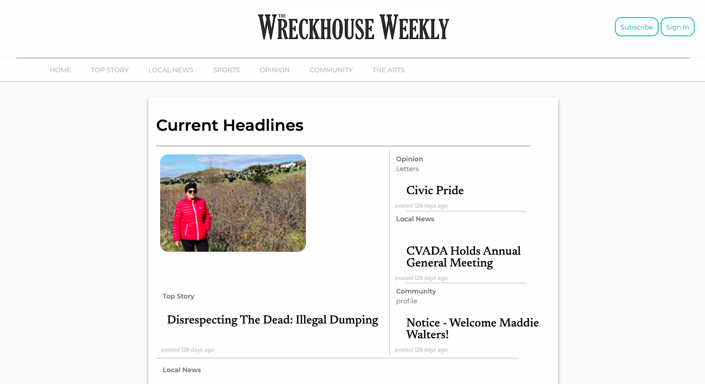
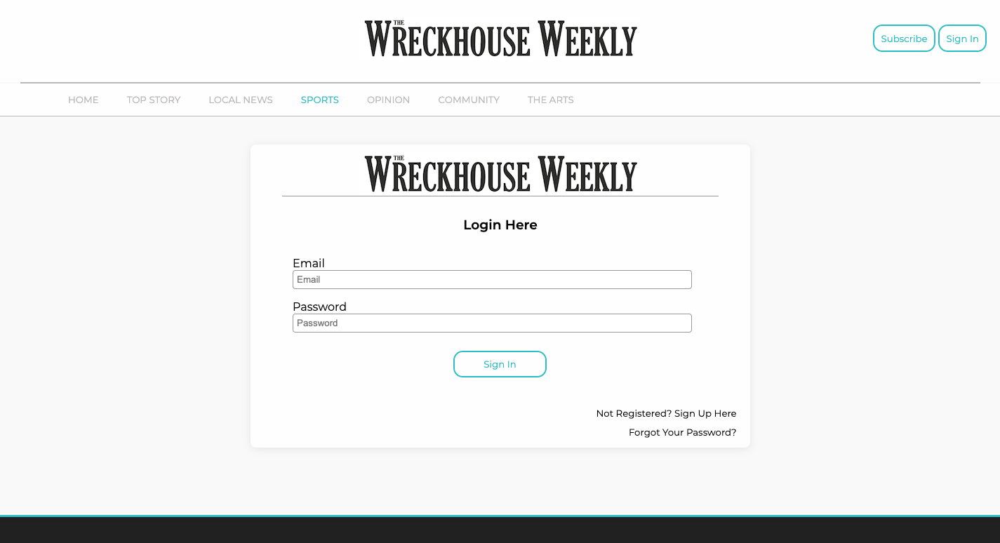
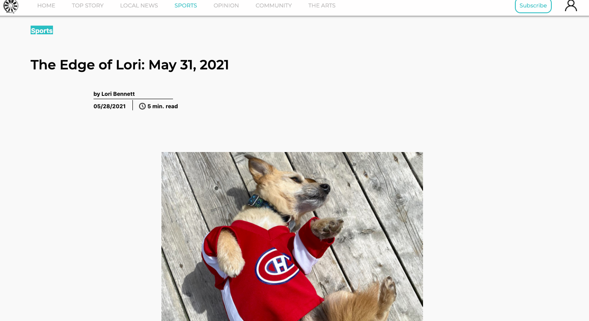
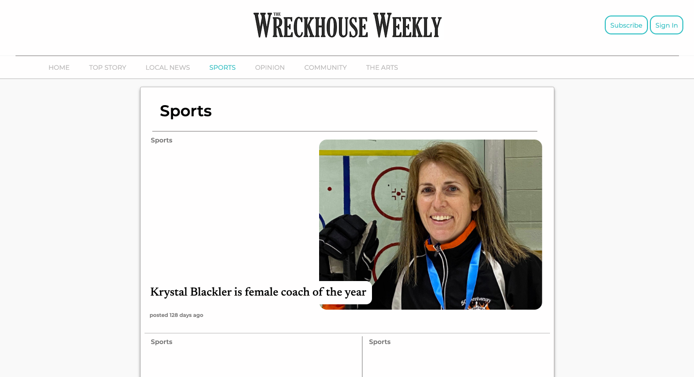
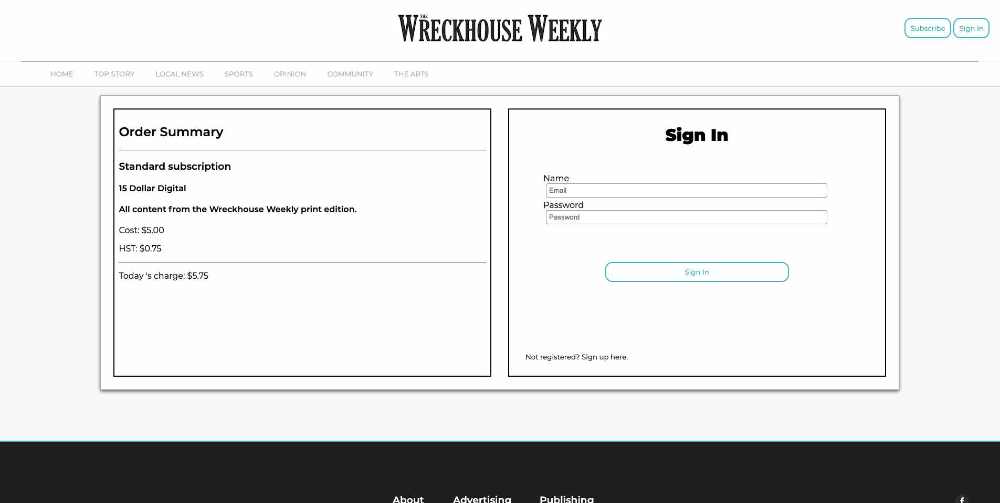

# Wreckhouse Press 
 The Backend for Wreckhouse Press's website, A Weekly newspaper based in Newfoundland.
## Live 
  [Check it out live here.](https://wreck-house-press-front-alpha.vercel.app/)
## Screenshots
#### Screenshot of Homepage

#### Screenshot of Sign In Page

#### Screenshot of Article

#### Screenshot of Category

#### Screenshot of Checkout

## Tech Stack
* Front-End: HTML, CSS, Next.js, Bootstrap, Vercel.

* Back-End: Ruby on Rails API, Postgres, Heroku.

## Setup

* Fork & Install dependencies with `bundle install`.
* Fork & Install dependencies for Frontend [here](https://github.com/kylemcloughlin/wreck-house-press-front)
* run `rails db:setup` or `rails db:create`, `rails db:migrate`, `rails db:seed`
* add stripe & email credentails
* Run `rails s -p 3001` - Backend
* Run `npm run dev` - Frontend

## Dependencies
  *  ruby -  ^2.7.2
  *  rails - ~> 6.0.3 >= 6.0.3.5
  *  pg - >= 0.18 < 2.0
  *  rack-cors
  *  stripe
  *  byebug
  * resque
  * resque-scheduler
  * sidekiq
  * bcrypt ~> 3.1.7
  * jwt
  * http ~> 3.0
